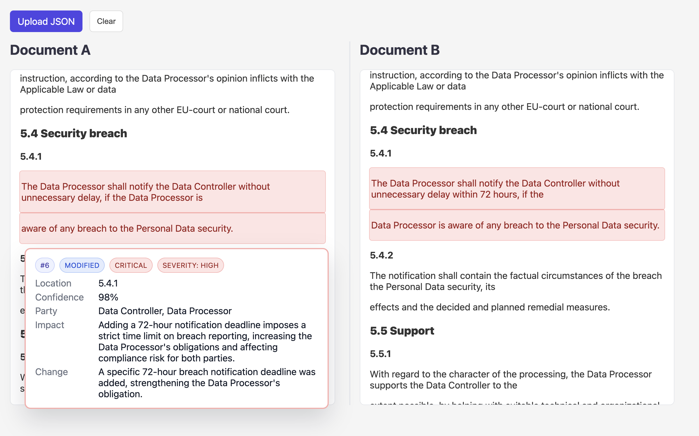

# Comp*AI*r - AI-based legal document comparison

## Prerequisites

- **uv**: Fast Python package and project manager by Astral. Install it using one of the following:
  - macOS (Homebrew):
    ```bash
    brew install uv
    ```
  - Official installer (all platforms):
    ```bash
    curl -LsSf https://astral.sh/uv/install.sh | sh
    ```
  - Docs: [`https://docs.astral.sh/uv/`](https://docs.astral.sh/uv/)

- **LLM API**: The implementation uses the OpenAI LLM APIs which can be used via OpenAI or Azure. This requires to provide an API key in a `.env` file. To configure one of both is enough. 
*NOTE*: the end-to-end approach *LLM-only* relies on PDF file upload and will only work with OpenAI, not AzureOpenAI.

```bash
OPENAI_API_KEY=...
AZURE_OPENAI_ENDPOINT=...
AZURE_OPENAI_API_KEY=...
```

## CLI tools usage

- **Install dependencies** (creates/updates the virtual environment):
  ```bash
  uv sync
  ```

- **Help message**:
```bash
uv run compair --help
```

```bash
usage: compair [-h] [-o OUTPUT] [-a {llm-light,llm-heavy,llm-only}] file1 file2

CLI tool for AI-based legal document comparison.

positional arguments:
file1                 Path to the first file to compare
file2                 Path to the second file to compare

options:
-h, --help            show this help message and exit
-o OUTPUT, --output OUTPUT
                        Path to the output json file
-a {llm-light,llm-heavy,llm-only}, --analysis-type {llm-light,llm-heavy,llm-only}
                        Type of analysis to perform
```

## Developer Usage

- **Check code is formatted** (no changes are made):
  ```bash
  uv run ruff format . --check
  ```

- **Run lints**:
  ```bash
  uv run ruff check .
  ```

- **Run tests**:
  ```bash
  uv run pytest -v
  ```

- **Type check**:
  ```bash
  uv run mypy
  ```

- **Docstring lint**:
  ```bash
  uv run darglint compair
  ```

## Dependencies

The CLI tool is configured with the following three packages and python3.12 (see pyproject.toml)

```bash
dependencies = [
    "dotenv>=0.9.9",
    "openai>=1.102.0",
    "pymupdf4llm>=0.0.17",
]
```

- **Create dependency list**:
  ```bash
  uv export --format requirements-txt --no-hashes --no-build --no-dev > generated/requirements.txt
  ```

## Approach

The task requires implementaing a processing pipeline relying on multiple NLP components. The choice for the individual components reaches from classical NLP building blocks to a end-to-end solution implemented with a single LLM API call. In-between, there is a whole spectrum of hybrid approaches which differ regarding latency, accuracy, token costs among others. The table below illustrates that rationale. The ***llm-light*** is the chosen solution approach providing the best trade-off regarding the named requirements. *llm-only* and *llm-heavy* are also implkemented but didn't lead to satisfying results (plus creating high latency and token cost). 

|                       | no-llm      | ***llm-light***   | ... | llm-heavy   | llm-only |
|-----------------------|-------------|-------------|-----|-------------|----------|
| parsing               | pymupdf4llm | pymupdf4llm |     | pymupdf4llm | LLM API  |
| normalization         | textacy     | textacy     |     | textacy     | LLM API  |
| clean-up              | textacy     | textacy     |     | textacy     | LLM API  |
| alignment             | rule-based  | rule-based  |     | LLM API     | LLM API  |
| change detection      | difflib     | difflib     |     | LLM API     | LLM API  |
| change categorization | rule-based  | LLM API     |     | LLM API     | LLM API  |
| impact analysis       | rule-based  | LLM API     |     | LLM API     | LLM API  |
| output generation     | rule-based  | rule-based  |     | LLM API     | LLM API  |

- **no-llm**: Fully deterministic, audit-friendly pipeline. Uses `pymupdf4llm` + classical
  preprocessing (e.g., textacy) for parsing/normalization/clean-up, rule-based alignment,
  `difflib` for change detection, rule-based categorization, impact analysis, and output generation.

- **llm-light**: Primarily deterministic with selective LLM assistance. Preprocessing, alignment,
  change detection, and output generation remain rule-based; the LLM is used for change categorization and impact analysis to add expert reasoning while preserving traceability.

- **llm-heavy**: Deterministic preprocessing (parsing/normalization/clean-up via `pymupdf4llm` and
  textacy), then delegate alignment, change detection, categorization, impact analysis, and output
  generation to the LLM. Higher flexibility and coverage, with less predictability and higher cost.

- **llm-only**: End-to-end LLM pipeline. Parsing is handled by the LLM API provider. Maximizes
  adaptability and speed of iteration, but is the least deterministic and most costly to operate.

## Result

- **Run on exmaple data**:
```bash
uv run compair tests/resources/1.pdf tests/resources/2.pdf -o generated/llm_light_diff_report.json -a llm-light
```

Resulting file can be found under [generated/llm_light_diff_report.json](generated/llm_light_diff_report.json)

## Limitations & Edge-Cases

The following discussion refers to the approach ***llm-light*** which turned out to work most reliable.

- **parsing**: Current parser directly parses to markdown without further alignment. Parsing individual sentences and align those would benefit the down-stream processes. In general, the only argument for using markdown was to have a nice layout in the web viewer. If the results are exported, then there is no benefit.

- **normalization**: Apply proper normalization which can improve the quality of the change detection, e.g. using textacy.

- **alignment**: Currently, no explicit alignment step is performed. The diff is directly applied to the markdown. Paragrpah, clause or sentence level alignment would further improve the detection.

- **change-detection**: The current approach uses character based change detection using `difflib`. Using unified diff format on large text chunks introduces noise and makes change detection more challenging (e.g. multiple changes in same diff hunk). Better approach would be to use token based change detection first.

- **moved sections**: Not covered by simple difflib approach as currently used. Could be done by proper chunking plus pair-comparison / convolution using cosine similarity metric (for exmaple). The *llm-heavy* approach should be able to deal with it.

- **referencing**: Current changes are derived from unified diff format including line references to the original text. This is sub-optimal if only single chars or words changed or if multiple different changes occur in a single diff hunk. Often the detected text chunks are not precisely located.

- **impact analysis**: This is the expert task in the pipeline requiring a lot of domain knowledge. For exmaple, few-shot exmaples in the prompt could help to improve the quality.

- **export**: Simple export functionality for critical changes in CSV format. A report like Word document might be more appropriate for legal teams?

- **latency**: Can be improved parallel LLM calls for the detected changes.


## Web viewer

An interactive web viewer is included to explore comparison results visually.

Features:
- Side-by-side markdown rendering of both documents
- Highlighting by category (red: Critical, yellow: Minor, green: Formatting)
- Hover cards with details (change type, severity, party, rationale, ...)
- Synced scrolling between panes
- Upload a JSON file (matching `generated/api.json` schema) to render

Prerequisites:
- Node.js 18+ and npm. Install via Homebrew or nvm, e.g.:
  ```bash
  brew install node
  # or using nvm
  # curl -o- https://raw.githubusercontent.com/nvm-sh/nvm/v0.39.7/install.sh | bash
  # nvm install --lts
  ```

Getting started:
```bash
cd web-viewer
npm install
npm run dev
```

Then open the shown local URL in your browser. Use the Upload JSON button to select a file.

Screenshot:

